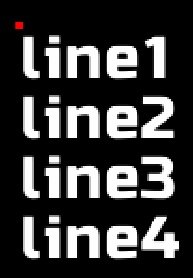
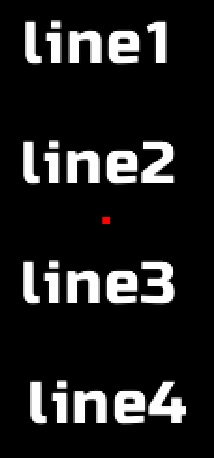
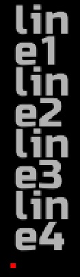

# GUI

The GUI module introduces a series of game object components and scripted behaviors to ease the setup of interactions between the player and the game whether that interaction happens on the HUD or anywhere in the 3D world.  
Require the [tags functionalities](/docs/craftstudio#tags) (the `CraftStudio` script).

- [Working with pixels and cameras](#working-with-pixels)
- [GUI components](#gui-components)
- [Hud](#hud)
- [Toggle](#toggle)
- [ProgressBar](#progressbar)
- [Slider](#slider)
- [Input](#input)
- [TextArea](#textarea)
- [Function reference](#function-reference)

## Working with pixels and cameras

The `Hud` component lets you position the game object "on screen", using pixels coordinates.  
Several of the other components also allows you set some value expressed in pixels instead of scene units.

The relation between scene units and pixels depends on the camera component that renders the object.

That's why those components must kept a reference to the camera game object they are rendered by.

This can be done simply by making the game object (with the GUI component) a child of the camera game object.  
You can also set the camera game object as the value of the `cameraGO` property in the component's parameters when you create it (or the camera game object's name as the value of the `cameraName` property of the component's scripted behavior).

This relation is mandatory for `Hud`, `Slider` and `Input` components, and required for `ProgressBar` and `TextArea` component only if you set a value expressed in pixel.

## GUI components

Each of the following components may be added via script with `gameObject:AddComponent(componentType[, params])`, or in the scene editor via the corresponding scripted behavior.

All the component's default properties may be found and tweaked in the config.

    function GUI.UserConfig()
        return {
            -- Default GUI components settings
            hud = {},

            toggle = {
                isChecked = false, -- false = unchecked, true = checked
                text = "Toggle",
                -- ':text' represents the toggle's text
                checkedMark = ":text",
                uncheckedMark = ":text",
                checkedModel = nil,
                uncheckedModel = nil,
            },

            progressBar = {
                height = 1,
                minValue = 0,
                maxValue = 100,
                minLength = 0,
                maxLength = 5, -- in units
                value = "100%",
            },

            slider = {
                minValue = 0,
                maxValue = 100,
                length = 5, -- 5 units
                axis = "x",
                value = "0%",
                OnTextEntered = nil
            },

            input = {
                isFocused = false,
                maxLength = 9999,
                defaultValue = nil,
                characterRange = nil,
                focusOnBackgroundClick = true,
                cursorBlinkInterval = 0.5, -- second
            },

            textArea = {
                areaWidth = 0, -- max line length, in units or pixel as a string (0 = no max length)
                wordWrap = false, -- when a line is longer than the area width: cut the ligne when false, put the rest of the ligne in one or several lines when true
                newLine = " ", -- end of line delimiter
                lineHeight = 1, -- in units or pixels
                verticalAlignment = "top",

                font = nil,
                text = "",
                alignment = nil,
                opacity = nil,
            },
        }
    end

All events fired at the components pass along the component instance as first and only argument.

The components with which you can interact with the mouse have the `guiComponent` tag. Be sure this tag is added to the `tags` property of the `Mouse Input` scripted behavior that you added to your camera game object (see below).

## Hud

The `Hud` component lets you position the game object "on screen", using screen coordinates (yet it remains a 3D element in the scene).

As said in the "Working with pixels and cameras" paragraph, the game object hosting a hud component must

- be a child of a game object with a camera component, or
- have a game object with a camera component set as the value of a `cameraGO` property in the component's properties when creating the component

Ie (when the hud game object isn't a child of a camera):

    self.gameObject:AddComponent( "Hud", {
        position = Vector2.New(0),
        cameraGO = GameObject.Get("Player Camera")
    } )

    self.gameObject:Set( { 
        hud = {
            position = Vector2.New(0),
            cameraGO = GameObject.Get("Player Camera")
        }
    } )

### Position

You can position a game object on screen using `hud:SetPosition(position)` or `hud:SetLocalPosition(position)` and get the position via the corresponding getter. The expected `position` argument is a `Vector2` (like `Vector3`, but with only the `x` and `y` components).  
The global position is relative to the HUD origin, while the local position is relative to the game object's parent (if any).

    local go1 = GameObject.New( "go1", { hud = {} } )
    local go2 = GameObject.New( "go2", { parent = go1, hud = {} } )
    
    go1.hud.position = Vector2.New( 20, 10 )
    go2.hud.localPosition = Vector2.New( 20, 10 )
    -- go2 has a global position of {40, 20}

    local go3 = GameObject.New( "go3", { 
        hud = { position = Vector2.New( 40, 20 ) }
    } )
    -- go2 and go3 are at the same position

The position can be expressed : 

- in pixels, as a number or a string suffixed by `"px"` (note that all other components consider numbers as scene units)
- in scene unit, as a string suffixed by `"u"`
- in percentage of the screen side's size, as a string suffixed by `"%"`. Ie : `Vector2.New( "50%", "50%" )` represents the center of the screen.
- relative to the screen side's size, represented by `"s"`. Ie :`"s-50"` means "screen size minus 50 pixels" (which makes 400 pixels for a 450 pixels wide and hight screen). `Vector2.New( "s-100" )` is a point at 100 pixels from the right and bottom sides of the screen.

### Layer

The layer is a number that describe in which plan the game object is positioned. The sign and value of the layer tells if the game object is behind or in front (and how far) of its reference.

All game objects that are visible from the camera have a positive global layer. A negative global layer effectively puts the game object behind the camera's viewport.  
The biggest the global layer, the farther away from the camera the game object is. Note that game objects that are too far away won't be rendered.

A strictly positive local layer (1 or bigger) means that the game object is behind its parent (from the camera's point of view), yet a negative local layer puts the game object in front (closer to the camera) of its parent.

Set the layer via `hud:SetLayer(layer)` and `hud:SetLocalLayer(layer)` and get it via the corresponding getter.

## Toggle

The `Toggle` component allows you to create check boxes or radio buttons.  
Interaction with the mouse are allowed by the [Mouse Input](/docs/mouse-input) script.

When the toggle uses a `TextRenderer`, it adds some additional (and optional) text (the 'check mark') to the TextRender's text to display the toggle's state. You may set the check mark for both state via the `checkedMark` and `uncheckedMark` properties.  
Use `toggle:GetText()` and `toggle:SetText(text)` to get and set the toggle's text without bothering with the check mark (it will be added/stripped automatically).

When the toggle uses a `ModelRenderer`, you may set two models (name or asset) via the `checkedModel` and `uncheckedModel` properties.

The check mark or the model will automatically be updated when the toggle's state is updated via `toggle:Check([state])` which also fires the `OnUpdate` event. Note that unlike all other optional boolean arguments, the default state is `true`.  
Get the state via the `isChecked` property. 

    gameObject:AddComponent( "Toggle", {
        checkedMark = "√ :text" -- ':text' represents the toggle's text, the rest is the check mark
        uncheckedMark = ":text: Nope!"
        -- if the toggle has "Mute sound" as its text, "√ Mute sound" is displayed when the state is true (checked)
        -- and "Mute sound: Nope!" is displayed when the state is false (unchecked)
    } )

    function gameObject.toggle.OnUpdate( toggle ) -- this function "catches" the OnUpdate event
        local state = "checked"
        if toggle.isChecked == false then
            state = "unchecked"
        end
        print( "The Toggle component on the game object of name '"..toggle.gameObject.name.."' is now "..state )
    end
    
    gameObject.toggle:Check( false )
    -- will print "The Toggle component on the game object of name 'Toggle' is now unchecked"

    gameObject.toggle:Check() -- or toggle:Check( true )
    -- will print "The Toggle component on the game object of name 'Toggle' is now checked"

### Toggles as radio buttons

You may put several toggles inside a same group to use them as radio buttons. Only one toggle in the group will be checked at a time.  
Set the group name via the `group` property. It adds the eponym tag to the toggles, so you may get them all via `GameObject.GetWithTag([groupName])`.

## ProgressBar

The `ProgressBar` component scales the game object to reflect the progress of a numerical parameter between a minimum and a maximum value.  

    gameObject:AddComponent( "ProgressBar" )
    gameObject.progressBar:Set( {
        minValue = 0, 
        maxValue = 500, 

        minLength = 0,
        maxLength = "250px", -- 250 pixels

        height = 0.5, -- 0.5 units
    } )

    gameObject.progressBar.value = 100 -- makes the bar 1/5 of its maximum length (50 pixels long)
    gameObject.progressBar.value = "90%" -- makes the bar 90% toward its maximum length from its minimum length (225 pixels long)

The `minValue` and `maxValue` properties set the boundaries of the parameter.  
The `value` property tells how far the parameter currently is toward `maxValue`. It can be an absolute value (between `minValue` and `maxValue`) or a percentage (as a string suffixed with `"%"`, between `"0%"` and `"100%"`).  
The `progressBar:SetValue()` function sends the `OnUpdate` event. You may also use the `progressBar:UpdateValue(progress, fireEvent)` for better performances, see paragraph below.

The `minLength` and `maxLength` properties set the min and max size of the bar. The bar's size is equal to `minLength` when `value` is equal to `minValue` or `"0%"` and equal to `maxLength` when `value` is equal to `maxValue` or `"100%"`.
The `height` property (or `Setheight()`) sets the height of the bar.

With these three properties, the size may be expressed as a `number` in scene units or in pixels as a `string` suffixed with `"px"`.
If you set one of these value as a string, they will be converted to `number` (and in scene units) the next time `SetValue()` is called.  

Yet the component only changes the game object's local scale, the bar is best rendered by a model that you have to add yourself.  
The direction the bar progress to (to the right, to the left or anything in-between) depends on how the model is created. The model should be a single block with a block size of 16 in every directions. 

At a position of `{0, 0, 0}` in the model editor, the origin of the progress bar is the center of the model, so the bar will scale to the right and to the left of its origin.  
Setting a position of `{-8, 0, 0}` puts the origin of the model to its right side, making the bar grow to the left of the screen, while a position of `{8, 0, 0}` will make the bar grow to the right.

Feel free to rotate the game object to get a vertical (or oblique) bar. Note that if the bar is vertical, the min and max length become the actual min and max height and the height become the actual width.

### Note on performance

Updating several dozen of progressBar per frame (when used as health bar for multiple game entities, for instance) may significantly slow down the game.  
It depends if the debug is enabled and which function you use to update the progress.  

`progressBar:UpdateValue()` is a faster version of `progressBar:SetValue()` but it does not check for type or value of the arguments.  

The table below shows some benchmark.  
The first column is the approximate number of progress bars updated per frame at which we begin to notice that the game runs slower than it should (with an otherwise empty project).

<table>
    <tr>
        <th>#</th>
        <th>Function</th>
        <th>Debug</th>
    </tr>

    <tr>
        <td>35</td>
        <td>SetValue()</td>
        <td rowspan="2">Enabled</td>
    </tr>
    <tr>
        <td>100</td>
        <td>UpdateValue()</td>
    </tr>

    <tr>
        <td>130</td>
        <td>SetValue()</td>
        <td rowspan="2">Disabled</td>
    </tr>
    <tr>
        <td>280</td>
        <td>UpdateValue()</td>
    </tr>
</table>

## Slider

The slider component lets the user set a value by dragging a handle displayed on the hud with the mouse.

Interaction with the mouse are allowed by the [Mouse Input](/docs/mouse-input) script.

As said in the "Working with pixels and cameras" paragraph, the game object hosting a slider component must

- be a child of a game object with a camera component, or
- have a game object with a camera component set as the value of a `cameraGO` property in the component's properties when creating the component

    gameObject:AddComponent( "Slider", {
        minValue = 0, 
        maxValue = 500,
        length = "100px", -- in pixels
        axis = "x", -- define if the slider is horizontal or vertical

        -- as with progressBar and toggle, the OnUpdate event is fired when the value changes
        OnUpdate = function( slider )
            print( "The slider has now a value of "..slider.value )
        end,

        cameraGO = GameObject.Get("Player Camera"),  -- not necessary when the game obejct is a child of a camera
    } )

    -- the value may also be set via script, the slider handle will be moved at the corresponding position
    gameObject.slider.value = "75%"

The `minValue` and `maxValue` properties set the boundaries of the value. The `length` property sets size of the slider.  
The `value` property is the current slider's value. It can be an absolute value (between `minValue` and `maxValue`) or a percentage (as a string suffixed with `"%"`, between `"0%"` and `"100%"`).  
The `OnUpdate` event is fired when the `slider:SetValue()` function is called or the handle is dragged.

The game object with the slider component must have a parent but if you didn't created it yourself, it will be created automatically at the slider's current position. The position of the parent is considered as the reference, where `value` = `minValue`.

The slider only works when used on the Hud and may only be dragged horizontally or vertically, based on the `axis` property. Set `"x"` for horizontal sliders (the start position is on the lef) or `"y"` for vertical sliders (the start position is on the bottom).  

The handle (the thing that is displayed and that the user drags with the mouse) may be a model, a map or a text on the same game object as the component.

## Input

The `Input` component creates a field where users can write text. The game object needs to have a `TextRenderer` component as well.  
Interaction with the mouse are allowed by the [Mouse Inputs](/docs/mouse-input) script.

As said in the "Working with pixels and cameras" paragraph, the game object hosting a hud component must

- be a child of a game object with a camera component, or
- have a game object with a camera component set as the value of a `cameraGO` property in the component's properties when creating the component

Input fields have a focused state that can be get via the `isFocused` property and set via the `input:Focus()` function which fires the `OnFocus` event.  
Input fields only react to user inputs when they are focused. Pressing the left mouse button (over the text or the background) will focus the field the mouse currently hovers (if any) and unfocus any fields that it doesn't hover.  

Updating the value via the `input:Update()` function or by keystroke fires the `OnUpdate` event.  
The `OnValidate` event is fired when the `ValidateInput` button is pressed and the field is focused.

The `maxLength` property allows to limit the number of characters of the input text.

The `characterRange` property allows to define the range of allowed characters that can be written in the field. Just set the property with a string containing all allowed characters.

The `defaultValue` property allows to setup a placeholder text.  
If the property is set and the input's text is empty when it gets unfocused, the input will be filled with the property's value.  
Similarly, the input text gets emptied when it gains focus and the text is the property's value.

The `focusOnBackgroundClick` property, when `true`, allows to focus the input when the user clicks over a `"Background"` game object that has a model renderer and is a child of the input (otherwise, the input happens only when the user clicks on the text).  
When the background game object exists, you can access it via `input.backgroundGO`.

You may also add a cursor to the input simply by having a `"Cursor"` game object with a model renderer as a child of the input. The cursor will be visible only when the input is focused and will blink at the rate defined by the `cursorBlinkInterval` property (in second).  
The position of the cursor is updated on focus and on each update of the text. The `OnUpdate` event is fired at the cursor game object, which you can get via `input.cursorGO`.  
Note that the cursor will always be at the end of the input text.  

    gameObject:AddComponent( "Input", {
        maxLength = 10, -- creates a field with 10 characters at most
        characterRange = "0123456789", -- creates a field where only positive integers are allowed
        defaultValue = 12345,
        OnValidate = function( input )
            DoSomething()
        end,

        cameraGO = GameObject.Get("Player Camera"), -- not necessary when the game obejct is a child of a camera
    } )
    

## TeaxtArea

The `TextArea` component is a flexible and multi-line text renderer.
It features all properties of a text renderer (font, text, alignment and opacity) plus some specific ones :

- `lineHeight` : height of a line in scene units or pixels (as a string suffixed by "px"). This only defines the space between two lines, it does not scale the lines.
- `verticalAlignment` : define the vertical positioning of the game object vis-à-vis of the text. Can be `"top"` (the text is below the game object), `"middle"` or `"bottom"`.
- `newLine` : string used to mark the end of a line (the string is not included in the line).
- `areaWidth` : maximum width of a line in scene units or pixels. Must be strictly positive
- `wordWrap` : define what happens when a line is longer than the area width: 
    - cut the line and discard the remaining characters when `false`
    - creates one or several new lines with the remaining characters when `true`

All of these properties may be get or set via their corresponding getter and setter.  
Note that the area width and line height do not take the scale of the gameObjet into account. They are size as they appear on-screen.

Yet it is not used to render the textArea's text, you can safely add a text renderer to the same game object as the textArea (in order to check for the text's size, for instance).

In the examples below, the small red square shows the position of the game object.
<table>
    <tr>
        <th>Example</th>
        <th>Result</th>
    </tr>

    <tr>
        <td>

<pre class="prettyprint linenums lang-lua"><code>
GameObject( "text area", {
    hud = { position = Vector2(300, 400) },  
    transform = { scale = 0.5 },
    modelRenderer = { model = "TextAreaCenter" },
    
    textArea = {
        font = "Russo One",
        text = "line1 :br:line2 :br:line3 :br:line4",
        
        lineHeight = 2,
        newLine = ":br:",
        --verticalAlignment = "top",
        --areaWidth = nil,
        --wordWrap = false,
    },
} )

</pre></code>
        </td>
        <td></td>
        
    </tr>
    <tr>
        <td>
<pre class="prettyprint linenums lang-lua"><code>
GameObject( "text area", {
    hud = { position = Vector2(300, 400) },  
    transform = { scale = 0.5 },
    modelRenderer = { model = "TextAreaCenter" },
    
    textArea = {
        font = "Russo One",
        text = "line1 |line2 |line3 |line4",
        alignment = "center",
        
        lineHeight = 4,
        newLine = "|",
        verticalAlignment = "middle",
        --areaWidth = nil,
        --wordWrap = false,
    },
} )

</code></pre>
        </td>
        <td></td>
    </tr>

    <tr>
        <td>
<pre class="prettyprint linenums lang-lua"><code>
GameObject( "text area", {
    hud = { position = Vector2(300, 400) },  
    transform = { scale = 0.5 },
    modelRenderer = { model = "TextAreaCenter" },
    
    textArea = {
        font = "Russo One",
        opacity = 0.7,
        text = 
[[line1
line2
line3
line4]],
        
        lineHeight = 1.5,
        verticalAlignment = "bottom",
        newLine = "\n",   
        areaWidth = 4,
        wordWrap = true,
    },
} )

</code></pre>
        </td>
        <td></td>
    </tr>
</table>

## Function reference

<table class="function_list">
    
        <tr>
            <td class="name"><a href="#CraftStudio.Input.GetMouseDelta">CraftStudio.Input.GetMouseDelta</a>(  )</td>
            <td class="summary">Return the mouse delta (the variation of position) since the last frame.</td>
        </tr>
    
        <tr>
            <td class="name"><a href="#CraftStudio.Input.GetMousePosition">CraftStudio.Input.GetMousePosition</a>(  )</td>
            <td class="summary">Return the mouse position on screen coordinates {x, y} </td>
        </tr>
    
        <tr>
            <td class="name"><a href="#CraftStudio.Screen.GetSize">CraftStudio.Screen.GetSize</a>(  )</td>
            <td class="summary">Return the size of the screen, in pixels.</td>
        </tr>
    
        <tr>
            <td class="name"><a href="#GUI.Hud.GetLayer">GUI.Hud.GetLayer</a>( hud )</td>
            <td class="summary">Get the gameObject's layer.</td>
        </tr>
    
        <tr>
            <td class="name"><a href="#GUI.Hud.GetLocalLayer">GUI.Hud.GetLocalLayer</a>( hud )</td>
            <td class="summary">Get the gameObject's local layer.</td>
        </tr>
    
        <tr>
            <td class="name"><a href="#GUI.Hud.GetLocalPosition">GUI.Hud.GetLocalPosition</a>( hud )</td>
            <td class="summary">Get the local position (relative to its parent) of the gameObject on screen.</td>
        </tr>
    
        <tr>
            <td class="name"><a href="#GUI.Hud.GetPosition">GUI.Hud.GetPosition</a>( hud )</td>
            <td class="summary">Get the position of the provided hud on the screen.</td>
        </tr>
    
        <tr>
            <td class="name"><a href="#GUI.Hud.New">GUI.Hud.New</a>( gameObject, params )</td>
            <td class="summary">Creates a new Hud component instance.</td>
        </tr>
    
        <tr>
            <td class="name"><a href="#GUI.Hud.SetLayer">GUI.Hud.SetLayer</a>( hud, layer )</td>
            <td class="summary">Set the gameObject's layer.</td>
        </tr>
    
        <tr>
            <td class="name"><a href="#GUI.Hud.SetLocalLayer">GUI.Hud.SetLocalLayer</a>( hud, layer )</td>
            <td class="summary">Set the huds's local layer.</td>
        </tr>
    
        <tr>
            <td class="name"><a href="#GUI.Hud.SetLocalPosition">GUI.Hud.SetLocalPosition</a>( hud, position )</td>
            <td class="summary">Sets the local position (relative to its parent) of the gameObject on screen .</td>
        </tr>
    
        <tr>
            <td class="name"><a href="#GUI.Hud.SetPosition">GUI.Hud.SetPosition</a>( hud, position )</td>
            <td class="summary">Sets the position of the gameObject on screen.</td>
        </tr>
    
        <tr>
            <td class="name"><a href="#GUI.Hud.ToHudPosition">GUI.Hud.ToHudPosition</a>( position )</td>
            <td class="summary">Transform the 3D position into a Hud position and a layer.</td>
        </tr>
    
        <tr>
            <td class="name"><a href="#GUI.Hud.ToPixel">GUI.Hud.ToPixel</a>( value, screenSide )</td>
            <td class="summary">Convert the provided value (a length) in a number expressed in screen pixel.</td>
        </tr>
    
        <tr>
            <td class="name"><a href="#GUI.Input.Focus">GUI.Input.Focus</a>( input, focus )</td>
            <td class="summary">Set the focused state of the input.</td>
        </tr>
    
        <tr>
            <td class="name"><a href="#GUI.Input.New">GUI.Input.New</a>( gameObject, params )</td>
            <td class="summary">Creates a new GUI.Input.</td>
        </tr>
    
        <tr>
            <td class="name"><a href="#GUI.Input.Update">GUI.Input.Update</a>( input, text, replaceText )</td>
            <td class="summary">Update the text of the input.</td>
        </tr>
    
        <tr>
            <td class="name"><a href="#GUI.Input.UpdateCursor">GUI.Input.UpdateCursor</a>( input )</td>
            <td class="summary">Update the cursor of the input.</td>
        </tr>
    
        <tr>
            <td class="name"><a href="#GUI.ProgressBar.GetHeight">GUI.ProgressBar.GetHeight</a>( progressBar )</td>
            <td class="summary">Get the height of the progress bar (the local scale's y component).</td>
        </tr>
    
        <tr>
            <td class="name"><a href="#GUI.ProgressBar.GetValue">GUI.ProgressBar.GetValue</a>( progressBar, getAsPercentage )</td>
            <td class="summary">Get the current value of the progress bar.</td>
        </tr>
    
        <tr>
            <td class="name"><a href="#GUI.ProgressBar.New">GUI.ProgressBar.New</a>( gameObject, params )</td>
            <td class="summary">Creates a new GUI.ProgressBar.</td>
        </tr>
    
        <tr>
            <td class="name"><a href="#GUI.ProgressBar.Set">GUI.ProgressBar.Set</a>( progressBar, params )</td>
            <td class="summary">Apply the content of the params argument to the provided progressBar.</td>
        </tr>
    
        <tr>
            <td class="name"><a href="#GUI.ProgressBar.SetHeight">GUI.ProgressBar.SetHeight</a>( progressBar, height )</td>
            <td class="summary">Set the height of the progress bar.</td>
        </tr>
    
        <tr>
            <td class="name"><a href="#GUI.ProgressBar.SetValue">GUI.ProgressBar.SetValue</a>( progressBar, value )</td>
            <td class="summary">Set the value of the progress bar, adjusting its length.</td>
        </tr>
    
        <tr>
            <td class="name"><a href="#GUI.ProgressBar.UpdateValue">GUI.ProgressBar.UpdateValue</a>( progressBar, value, fireEvent )</td>
            <td class="summary">Set the value of the progress bar, adjusting its length.</td>
        </tr>
    
        <tr>
            <td class="name"><a href="#GUI.Slider.GetValue">GUI.Slider.GetValue</a>( slider, getAsPercentage )</td>
            <td class="summary">Get the current slider's value.</td>
        </tr>
    
        <tr>
            <td class="name"><a href="#GUI.Slider.New">GUI.Slider.New</a>( gameObject, params )</td>
            <td class="summary">Creates a new GUI.Slider.</td>
        </tr>
    
        <tr>
            <td class="name"><a href="#GUI.Slider.Set">GUI.Slider.Set</a>( slider, params )</td>
            <td class="summary">Apply the content of the params argument to the provided slider.</td>
        </tr>
    
        <tr>
            <td class="name"><a href="#GUI.Slider.SetValue">GUI.Slider.SetValue</a>( slider, value )</td>
            <td class="summary">Set the value of the slider, adjusting its position.</td>
        </tr>
    
        <tr>
            <td class="name"><a href="#GUI.TextArea.GetAlignment">GUI.TextArea.GetAlignment</a>( textArea )</td>
            <td class="summary">Get the component's horizontal alignment.</td>
        </tr>
    
        <tr>
            <td class="name"><a href="#GUI.TextArea.GetAreaWidth">GUI.TextArea.GetAreaWidth</a>( textArea )</td>
            <td class="summary">Get the component's area width.</td>
        </tr>
    
        <tr>
            <td class="name"><a href="#GUI.TextArea.GetFont">GUI.TextArea.GetFont</a>( textArea )</td>
            <td class="summary">Get the component's font used to render the text.</td>
        </tr>
    
        <tr>
            <td class="name"><a href="#GUI.TextArea.GetLineHeight">GUI.TextArea.GetLineHeight</a>( textArea )</td>
            <td class="summary">Get the component's line height.</td>
        </tr>
    
        <tr>
            <td class="name"><a href="#GUI.TextArea.GetNewLine">GUI.TextArea.GetNewLine</a>( textArea )</td>
            <td class="summary">Get the component's newLine string.</td>
        </tr>
    
        <tr>
            <td class="name"><a href="#GUI.TextArea.GetOpacity">GUI.TextArea.GetOpacity</a>( textArea )</td>
            <td class="summary">Get the component's opacity.</td>
        </tr>
    
        <tr>
            <td class="name"><a href="#GUI.TextArea.GetText">GUI.TextArea.GetText</a>( textArea )</td>
            <td class="summary">Get the component's text.</td>
        </tr>
    
        <tr>
            <td class="name"><a href="#GUI.TextArea.GetVerticalAlignment">GUI.TextArea.GetVerticalAlignment</a>( textArea )</td>
            <td class="summary">Get the component's vertical alignment property.</td>
        </tr>
    
        <tr>
            <td class="name"><a href="#GUI.TextArea.GetWordWrap">GUI.TextArea.GetWordWrap</a>( textArea )</td>
            <td class="summary">Get the component's wordWrap property.</td>
        </tr>
    
        <tr>
            <td class="name"><a href="#GUI.TextArea.New">GUI.TextArea.New</a>( gameObject, params )</td>
            <td class="summary">Creates a new TextArea component.</td>
        </tr>
    
        <tr>
            <td class="name"><a href="#GUI.TextArea.Set">GUI.TextArea.Set</a>( textArea, params )</td>
            <td class="summary">Apply the content of the params argument to the provided textArea.</td>
        </tr>
    
        <tr>
            <td class="name"><a href="#GUI.TextArea.SetAlignment">GUI.TextArea.SetAlignment</a>( textArea, alignment )</td>
            <td class="summary">Set the component's alignment.</td>
        </tr>
    
        <tr>
            <td class="name"><a href="#GUI.TextArea.SetAreaWidth">GUI.TextArea.SetAreaWidth</a>( textArea, areaWidth )</td>
            <td class="summary">Set the component's area width (maximum line length).</td>
        </tr>
    
        <tr>
            <td class="name"><a href="#GUI.TextArea.SetFont">GUI.TextArea.SetFont</a>( textArea, font )</td>
            <td class="summary">Set the component's font used to renderer the text.</td>
        </tr>
    
        <tr>
            <td class="name"><a href="#GUI.TextArea.SetLineHeight">GUI.TextArea.SetLineHeight</a>( textArea, lineHeight )</td>
            <td class="summary">Set the component's line height.</td>
        </tr>
    
        <tr>
            <td class="name"><a href="#GUI.TextArea.SetNewLine">GUI.TextArea.SetNewLine</a>( textArea, newLine )</td>
            <td class="summary">Set the component's newLine string used by SetText() to split the input text in several lines.</td>
        </tr>
    
        <tr>
            <td class="name"><a href="#GUI.TextArea.SetOpacity">GUI.TextArea.SetOpacity</a>( textArea, opacity )</td>
            <td class="summary">Set the component's opacity.</td>
        </tr>
    
        <tr>
            <td class="name"><a href="#GUI.TextArea.SetText">GUI.TextArea.SetText</a>( textArea, text )</td>
            <td class="summary">Set the component's text.</td>
        </tr>
    
        <tr>
            <td class="name"><a href="#GUI.TextArea.SetVerticalAlignment">GUI.TextArea.SetVerticalAlignment</a>( textArea, verticalAlignment )</td>
            <td class="summary">Set the component's vertical alignment.</td>
        </tr>
    
        <tr>
            <td class="name"><a href="#GUI.TextArea.SetWordWrap">GUI.TextArea.SetWordWrap</a>( textArea, wordWrap )</td>
            <td class="summary">Set the component's wordWrap property.</td>
        </tr>
    
        <tr>
            <td class="name"><a href="#GUI.ToSceneUnit">GUI.ToSceneUnit</a>( value )</td>
            <td class="summary">Convert the provided value (a length) in a number expressed in scene unit.</td>
        </tr>
    
        <tr>
            <td class="name"><a href="#GUI.Toggle.Check">GUI.Toggle.Check</a>( toggle, state, forceUpdate )</td>
            <td class="summary">Check or uncheck the provided toggle and fire the OnUpdate event.</td>
        </tr>
    
        <tr>
            <td class="name"><a href="#GUI.Toggle.GetText">GUI.Toggle.GetText</a>( toggle )</td>
            <td class="summary">Get the provided toggle's text.</td>
        </tr>
    
        <tr>
            <td class="name"><a href="#GUI.Toggle.New">GUI.Toggle.New</a>( gameObject, params )</td>
            <td class="summary">Creates a new Toggle component.</td>
        </tr>
    
        <tr>
            <td class="name"><a href="#GUI.Toggle.Set">GUI.Toggle.Set</a>( toggle, params )</td>
            <td class="summary">Apply the content of the params argument to the provided toggle.</td>
        </tr>
    
        <tr>
            <td class="name"><a href="#GUI.Toggle.SetGroup">GUI.Toggle.SetGroup</a>( toggle, group )</td>
            <td class="summary">Set the toggle's group.</td>
        </tr>
    
        <tr>
            <td class="name"><a href="#GUI.Toggle.SetText">GUI.Toggle.SetText</a>( toggle, text )</td>
            <td class="summary">Set the provided toggle's text.</td>
        </tr>
    
        <tr>
            <td class="name"><a href="#TextRenderer.SetTextWidth">TextRenderer.SetTextWidth</a>( textRenderer, width )</td>
            <td class="summary">Update the gameObject's scale to make the text appear the provided width.</td>
        </tr>
    
        <tr>
            <td class="name"><a href="#Vector2.GetLength">Vector2.GetLength</a>( vector )</td>
            <td class="summary">Return the length of the vector.</td>
        </tr>
    
        <tr>
            <td class="name"><a href="#Vector2.GetSqrLength">Vector2.GetSqrLength</a>( vector )</td>
            <td class="summary">Return the squared length of the vector.</td>
        </tr>
    
        <tr>
            <td class="name"><a href="#Vector2.New">Vector2.New</a>( x, y )</td>
            <td class="summary">Creates a new Vector2 intance.</td>
        </tr>
    
        <tr>
            <td class="name"><a href="#Vector2.Normalize">Vector2.Normalize</a>( vector )</td>
            <td class="summary">Normalize the provided vector in place (makes its length equal to 1).</td>
        </tr>
    
        <tr>
            <td class="name"><a href="#Vector2.Normalized">Vector2.Normalized</a>( vector )</td>
            <td class="summary">Return a copy of the provided vector, normalized.</td>
        </tr>
    
        <tr>
            <td class="name"><a href="#Vector2.__add">Vector2.__add</a>( a, b )</td>
            <td class="summary">Allow to add two Vector2 by using the + operator.</td>
        </tr>
    
        <tr>
            <td class="name"><a href="#Vector2.__div">Vector2.__div</a>( a, b )</td>
            <td class="summary">Allow to divide two Vector2 or a Vector2 and a number by using the / operator.</td>
        </tr>
    
        <tr>
            <td class="name"><a href="#Vector2.__eq">Vector2.__eq</a>( a, b )</td>
            <td class="summary">Allow to check for the equality between two Vector2 using the == comparison operator.</td>
        </tr>
    
        <tr>
            <td class="name"><a href="#Vector2.__mul">Vector2.__mul</a>( a, b )</td>
            <td class="summary">Allow to multiply two Vector2 or a Vector2 and a number by using the * operator.</td>
        </tr>
    
        <tr>
            <td class="name"><a href="#Vector2.__pow">Vector2.__pow</a>( vector, exp )</td>
            <td class="summary">Allow to raise a Vector2 to a power using the ^ operator.</td>
        </tr>
    
        <tr>
            <td class="name"><a href="#Vector2.__sub">Vector2.__sub</a>( a, b )</td>
            <td class="summary">Allow to substract two Vector2 by using the - operator.</td>
        </tr>
    
        <tr>
            <td class="name"><a href="#Vector2.__unm">Vector2.__unm</a>( vector )</td>
            <td class="summary">Allow to inverse a vector2 using the - operator.</td>
        </tr>
    
</table>

<dl class="function">
    
        
<dt><h3>CraftStudio.Input.GetMouseDelta(  )</h3></dt>
<dd>
Return the mouse delta (the variation of position) since the last frame. Positive x is right, positive y is bottom.
  

    <strong>Return value:</strong>
    <ul>(Vector2) The position's delta.</ul>

</dd>

    
        
<dt><h3>CraftStudio.Input.GetMousePosition(  )</h3></dt>
<dd>
Return the mouse position on screen coordinates {x, y}
  

    <strong>Return value:</strong>
    <ul>(Vector2) The on-screen mouse position.</ul>

</dd>

    
        
<dt><h3>CraftStudio.Screen.GetSize(  )</h3></dt>
<dd>
Return the size of the screen, in pixels.
  

    <strong>Return value:</strong>
    <ul>(Vector2) The screen's size.</ul>

</dd>

    
        
<dt><h3>GUI.Hud.GetLayer( hud )</h3></dt>
<dd>
Get the gameObject's layer.
  

    <strong>Parameters:</strong>
    <ul>
        
        <li>
          hud (Hud) The hud component.
        </li>
        
    </ul>

    <strong>Return value:</strong>
    <ul>(number) The layer (with one decimal).</ul>

</dd>

    
        
<dt><h3>GUI.Hud.GetLocalLayer( hud )</h3></dt>
<dd>
Get the gameObject's local layer.
  

    <strong>Parameters:</strong>
    <ul>
        
        <li>
          hud (Hud) The hud component.
        </li>
        
    </ul>

    <strong>Return value:</strong>
    <ul>(number) The layer (with one decimal).</ul>

</dd>

    
        
<dt><h3>GUI.Hud.GetLocalPosition( hud )</h3></dt>
<dd>
Get the local position (relative to its parent) of the gameObject on screen.
  

    <strong>Parameters:</strong>
    <ul>
        
        <li>
          hud (Hud) The hud component.
        </li>
        
    </ul>

    <strong>Return value:</strong>
    <ul>(Vector2) The position.</ul>

</dd>

    
        
<dt><h3>GUI.Hud.GetPosition( hud )</h3></dt>
<dd>
Get the position of the provided hud on the screen.
  

    <strong>Parameters:</strong>
    <ul>
        
        <li>
          hud (Hud) The hud component.
        </li>
        
    </ul>

    <strong>Return value:</strong>
    <ul>(Vector2) The position.</ul>

</dd>

    
        
<dt><h3>GUI.Hud.New( gameObject, params )</h3></dt>
<dd>
Creates a new Hud component instance.
  

    <strong>Parameters:</strong>
    <ul>
        
        <li>
          gameObject (GameObject) The gameObject to add to the component to.
        </li>
        
        <li>
          params (table) [optional] A table of parameters.
        </li>
        
    </ul>

    <strong>Return value:</strong>
    <ul>(Hud) The hud component.</ul>

</dd>

    
        
<dt><h3>GUI.Hud.SetLayer( hud, layer )</h3></dt>
<dd>
Set the gameObject's layer.
  

    <strong>Parameters:</strong>
    <ul>
        
        <li>
          hud (Hud) The hud component.
        </li>
        
        <li>
          layer (number) The layer (a postive number).
        </li>
        
    </ul>

</dd>

    
        
<dt><h3>GUI.Hud.SetLocalLayer( hud, layer )</h3></dt>
<dd>
Set the huds's local layer.
  

    <strong>Parameters:</strong>
    <ul>
        
        <li>
          hud (Hud) The hud component.
        </li>
        
        <li>
          layer (number) The layer (a postiv number).
        </li>
        
    </ul>

</dd>

    
        
<dt><h3>GUI.Hud.SetLocalPosition( hud, position )</h3></dt>
<dd>
Sets the local position (relative to its parent) of the gameObject on screen .
  

    <strong>Parameters:</strong>
    <ul>
        
        <li>
          hud (Hud) The hud component.
        </li>
        
        <li>
          position (Vector2) The position as a Vector2.
        </li>
        
    </ul>

</dd>

    
        
<dt><h3>GUI.Hud.SetPosition( hud, position )</h3></dt>
<dd>
Sets the position of the gameObject on screen. With the top-left corner of the screen as origin.
  

    <strong>Parameters:</strong>
    <ul>
        
        <li>
          hud (Hud) The hud component.
        </li>
        
        <li>
          position (Vector2) The position as a Vector2.
        </li>
        
    </ul>

</dd>

    
        
<dt><h3>GUI.Hud.ToHudPosition( position )</h3></dt>
<dd>
Transform the 3D position into a Hud position and a layer.
  

    <strong>Parameters:</strong>
    <ul>
        
        <li>
          position (Vector3) The 3D position.
        </li>
        
    </ul>

    <strong>Return values:</strong>
    <ol>
        
        <li>(Vector2) The hud position.</li>
        
        <li>(numbe) The layer.</li>
        
    </ol>

</dd>

    
        
<dt><h3>GUI.Hud.ToPixel( value, screenSide )</h3></dt>
<dd>
Convert the provided value (a length) in a number expressed in screen pixel. The provided value may be suffixed with "px" or be expressed in percentage (ie: "10%") or be relative (ie: "s" or "s-10") to the specified screen side size (in which case the 'screenSide' argument is mandatory).
  

    <strong>Parameters:</strong>
    <ul>
        
        <li>
          value (string or number) The value to convert.
        </li>
        
        <li>
          screenSide (string) [optional] "x" (width) or "y" (height)
        </li>
        
    </ul>

    <strong>Return value:</strong>
    <ul>(number) The converted value, expressed in pixels.</ul>

</dd>

    
        
<dt><h3>GUI.Input.Focus( input, focus )</h3></dt>
<dd>
Set the focused state of the input.
  

    <strong>Parameters:</strong>
    <ul>
        
        <li>
          input (Input) The input component.
        </li>
        
        <li>
          focus (boolean) [optional default=true] The new focus.
        </li>
        
    </ul>

</dd>

    
        
<dt><h3>GUI.Input.New( gameObject, params )</h3></dt>
<dd>
Creates a new GUI.Input.
  

    <strong>Parameters:</strong>
    <ul>
        
        <li>
          gameObject (GameObject) The component gameObject.
        </li>
        
        <li>
          params (table) A table of parameters.
        </li>
        
    </ul>

    <strong>Return value:</strong>
    <ul>(Input) The new component.</ul>

</dd>

    
        
<dt><h3>GUI.Input.Update( input, text, replaceText )</h3></dt>
<dd>
Update the text of the input.
  

    <strong>Parameters:</strong>
    <ul>
        
        <li>
          input (Input) The input component.
        </li>
        
        <li>
          text (string) The text (often just one character) to add to the current text.
        </li>
        
        <li>
          replaceText (boolean) [optional default=false] Tell wether the provided text should be added (false) or replace (true) the current text.
        </li>
        
    </ul>

</dd>

    
        
<dt><h3>GUI.Input.UpdateCursor( input )</h3></dt>
<dd>
Update the cursor of the input.
  

    <strong>Parameters:</strong>
    <ul>
        
        <li>
          input (Input) The input component.
        </li>
        
    </ul>

</dd>

    
        
<dt><h3>GUI.ProgressBar.GetHeight( progressBar )</h3></dt>
<dd>
Get the height of the progress bar (the local scale's y component).
  

    <strong>Parameters:</strong>
    <ul>
        
        <li>
          progressBar (ProgressBar) The progressBar.
        </li>
        
    </ul>

    <strong>Return value:</strong>
    <ul>(number) The height.</ul>

</dd>

    
        
<dt><h3>GUI.ProgressBar.GetValue( progressBar, getAsPercentage )</h3></dt>
<dd>
Get the current value of the progress bar.
  

    <strong>Parameters:</strong>
    <ul>
        
        <li>
          progressBar (ProgressBar) The progressBar.
        </li>
        
        <li>
          getAsPercentage [optional default=false] (boolean) Get the value as a percentage (between 0 and 100) instead of an absolute value.
        </li>
        
    </ul>

    <strong>Return value:</strong>
    <ul>(number) The value.</ul>

</dd>

    
        
<dt><h3>GUI.ProgressBar.New( gameObject, params )</h3></dt>
<dd>
Creates a new GUI.ProgressBar.
  

    <strong>Parameters:</strong>
    <ul>
        
        <li>
          gameObject (GameObject) The component gameObject.
        </li>
        
        <li>
          params (table) A table of parameters.
        </li>
        
    </ul>

    <strong>Return value:</strong>
    <ul>(ProgressBar) The new component.</ul>

</dd>

    
        
<dt><h3>GUI.ProgressBar.Set( progressBar, params )</h3></dt>
<dd>
Apply the content of the params argument to the provided progressBar. Overwrite Component.Set() from CraftStudio module.
  

    <strong>Parameters:</strong>
    <ul>
        
        <li>
          progressBar (ProgressBar) The progressBar.
        </li>
        
        <li>
          params (table) A table of parameters to set the component with.
        </li>
        
    </ul>

</dd>

    
        
<dt><h3>GUI.ProgressBar.SetHeight( progressBar, height )</h3></dt>
<dd>
Set the height of the progress bar.
  

    <strong>Parameters:</strong>
    <ul>
        
        <li>
          progressBar (ProgressBar) The progressBar.
        </li>
        
        <li>
          height (number or string) Get the height in pixel or scene unit.
        </li>
        
    </ul>

</dd>

    
        
<dt><h3>GUI.ProgressBar.SetValue( progressBar, value )</h3></dt>
<dd>
Set the value of the progress bar, adjusting its length. Fires the 'OnUpdate' event.
  

    <strong>Parameters:</strong>
    <ul>
        
        <li>
          progressBar (ProgressBar) The progressBar.
        </li>
        
        <li>
          value (number or string) The value as a number (between minVal and maxVal) or as a string and a percentage (between "0%" and "100%").
        </li>
        
    </ul>

</dd>

    
        
<dt><h3>GUI.ProgressBar.UpdateValue( progressBar, value, fireEvent )</h3></dt>
<dd>
Set the value of the progress bar, adjusting its length. Does the same things as SetProgress() by does it faster. Unlike SetProgress(), does not fire the 'OnUpdate' event by default. Should be used when the value is updated regularly (ie : from a Behavior:Update() function).
  

    <strong>Parameters:</strong>
    <ul>
        
        <li>
          progressBar (ProgressBar) The progressBar.
        </li>
        
        <li>
          value (number or string) The value as a number (between minVal and maxVal) or as a string and a percentage (between "0%" and "100%").
        </li>
        
        <li>
          fireEvent [optional default=false] (boolean) Tell wether to fire the 'OnUpdate' event (true) or not (false).
        </li>
        
    </ul>

</dd>

    
        
<dt><h3>GUI.Slider.GetValue( slider, getAsPercentage )</h3></dt>
<dd>
Get the current slider's value.
  

    <strong>Parameters:</strong>
    <ul>
        
        <li>
          slider (Slider) The slider.
        </li>
        
        <li>
          getAsPercentage [optional default=false] (boolean) Get the value as a percentage (between 0 and 100) instead of an absolute value.
        </li>
        
    </ul>

    <strong>Return value:</strong>
    <ul>(number) The value.</ul>

</dd>

    
        
<dt><h3>GUI.Slider.New( gameObject, params )</h3></dt>
<dd>
Creates a new GUI.Slider.
  

    <strong>Parameters:</strong>
    <ul>
        
        <li>
          gameObject (GameObject) The component gameObject.
        </li>
        
        <li>
          params (table) A table of parameters.
        </li>
        
    </ul>

    <strong>Return value:</strong>
    <ul>(Slider) The new component.</ul>

</dd>

    
        
<dt><h3>GUI.Slider.Set( slider, params )</h3></dt>
<dd>
Apply the content of the params argument to the provided slider. Overwrite Component.Set() from the core.
  

    <strong>Parameters:</strong>
    <ul>
        
        <li>
          slider (Slider) The slider.
        </li>
        
        <li>
          params (table) A table of parameters to set the component with.
        </li>
        
    </ul>

</dd>

    
        
<dt><h3>GUI.Slider.SetValue( slider, value )</h3></dt>
<dd>
Set the value of the slider, adjusting its position.
  

    <strong>Parameters:</strong>
    <ul>
        
        <li>
          slider (Slider) The slider.
        </li>
        
        <li>
          value (number or string) The value as a number (between minVal and maxVal) or as a string and a percentage (between "0%" and "100%").
        </li>
        
    </ul>

</dd>

    
        
<dt><h3>GUI.TextArea.GetAlignment( textArea )</h3></dt>
<dd>
Get the component's horizontal alignment.
  

    <strong>Parameters:</strong>
    <ul>
        
        <li>
          textArea (TextArea) The textArea component.
        </li>
        
    </ul>

    <strong>Return value:</strong>
    <ul>(TextRenderer.Alignment or number) The alignment (of type number in the webplayer).</ul>

</dd>

    
        
<dt><h3>GUI.TextArea.GetAreaWidth( textArea )</h3></dt>
<dd>
Get the component's area width.
  

    <strong>Parameters:</strong>
    <ul>
        
        <li>
          textArea (TextArea) The textArea component.
        </li>
        
    </ul>

    <strong>Return value:</strong>
    <ul>(number) The area width in scene units.</ul>

</dd>

    
        
<dt><h3>GUI.TextArea.GetFont( textArea )</h3></dt>
<dd>
Get the component's font used to render the text.
  

    <strong>Parameters:</strong>
    <ul>
        
        <li>
          textArea (TextArea) The textArea component.
        </li>
        
    </ul>

    <strong>Return value:</strong>
    <ul>(Font) The font.</ul>

</dd>

    
        
<dt><h3>GUI.TextArea.GetLineHeight( textArea )</h3></dt>
<dd>
Get the component's line height.
  

    <strong>Parameters:</strong>
    <ul>
        
        <li>
          textArea (TextArea) The textArea component.
        </li>
        
    </ul>

    <strong>Return value:</strong>
    <ul>(number) The line height in scene units.</ul>

</dd>

    
        
<dt><h3>GUI.TextArea.GetNewLine( textArea )</h3></dt>
<dd>
Get the component's newLine string.
  

    <strong>Parameters:</strong>
    <ul>
        
        <li>
          textArea (TextArea) The textArea component.
        </li>
        
    </ul>

    <strong>Return value:</strong>
    <ul>(string) The newLine string.</ul>

</dd>

    
        
<dt><h3>GUI.TextArea.GetOpacity( textArea )</h3></dt>
<dd>
Get the component's opacity.
  

    <strong>Parameters:</strong>
    <ul>
        
        <li>
          textArea (TextArea) The textArea component.
        </li>
        
    </ul>

    <strong>Return value:</strong>
    <ul>(number) The opacity between 0.0 and 1.0.</ul>

</dd>

    
        
<dt><h3>GUI.TextArea.GetText( textArea )</h3></dt>
<dd>
Get the component's text.
  

    <strong>Parameters:</strong>
    <ul>
        
        <li>
          textArea (TextArea) The textArea component.
        </li>
        
    </ul>

    <strong>Return value:</strong>
    <ul>(string) The component's text.</ul>

</dd>

    
        
<dt><h3>GUI.TextArea.GetVerticalAlignment( textArea )</h3></dt>
<dd>
Get the component's vertical alignment property.
  

    <strong>Parameters:</strong>
    <ul>
        
        <li>
          textArea (TextArea) The textArea component.
        </li>
        
    </ul>

    <strong>Return value:</strong>
    <ul>(string) The vertical alignment.</ul>

</dd>

    
        
<dt><h3>GUI.TextArea.GetWordWrap( textArea )</h3></dt>
<dd>
Get the component's wordWrap property.
  

    <strong>Parameters:</strong>
    <ul>
        
        <li>
          textArea (TextArea) The textArea component.
        </li>
        
    </ul>

    <strong>Return value:</strong>
    <ul>(boolean) True or false.</ul>

</dd>

    
        
<dt><h3>GUI.TextArea.New( gameObject, params )</h3></dt>
<dd>
Creates a new TextArea component.
  

    <strong>Parameters:</strong>
    <ul>
        
        <li>
          gameObject (GameObject) The game object.
        </li>
        
        <li>
          params (table) A table of parameters.
        </li>
        
    </ul>

    <strong>Return value:</strong>
    <ul>(TextArea) The new component.</ul>

</dd>

    
        
<dt><h3>GUI.TextArea.Set( textArea, params )</h3></dt>
<dd>
Apply the content of the params argument to the provided textArea. Overwrite Component.Set() from the core.
  

    <strong>Parameters:</strong>
    <ul>
        
        <li>
          textArea (TextArea) The textArea.
        </li>
        
        <li>
          params (table) A table of parameters to set the component with.
        </li>
        
    </ul>

</dd>

    
        
<dt><h3>GUI.TextArea.SetAlignment( textArea, alignment )</h3></dt>
<dd>
Set the component's alignment. Works like a TextRenderer alignment.
  

    <strong>Parameters:</strong>
    <ul>
        
        <li>
          textArea (TextArea) The textArea component.
        </li>
        
        <li>
          alignment (TextRenderer.Alignment or string) One of the values in the 'TextRenderer.Alignment' enum (Left, Center or Right) or the same values as case-insensitive string ("left", "center" or "right").
        </li>
        
    </ul>

</dd>

    
        
<dt><h3>GUI.TextArea.SetAreaWidth( textArea, areaWidth )</h3></dt>
<dd>
Set the component's area width (maximum line length). Must be strictly positive to have an effect. Set as a negative value, 0 or nil to remove the limitation.
  

    <strong>Parameters:</strong>
    <ul>
        
        <li>
          textArea (TextArea) The textArea component.
        </li>
        
        <li>
          areaWidth (number or string) The area width in scene units or in pixels as a string suffixed with "px".
        </li>
        
    </ul>

</dd>

    
        
<dt><h3>GUI.TextArea.SetFont( textArea, font )</h3></dt>
<dd>
Set the component's font used to renderer the text.
  

    <strong>Parameters:</strong>
    <ul>
        
        <li>
          textArea (TextArea) The textArea component.
        </li>
        
        <li>
          font (Font or string) The font asset or fully-qualified path.
        </li>
        
    </ul>

</dd>

    
        
<dt><h3>GUI.TextArea.SetLineHeight( textArea, lineHeight )</h3></dt>
<dd>
Set the component's line height.
  

    <strong>Parameters:</strong>
    <ul>
        
        <li>
          textArea (TextArea) The textArea component.
        </li>
        
        <li>
          lineHeight (number or string) The line height in scene units or in pixels as a string suffixed with "px".
        </li>
        
    </ul>

</dd>

    
        
<dt><h3>GUI.TextArea.SetNewLine( textArea, newLine )</h3></dt>
<dd>
Set the component's newLine string used by SetText() to split the input text in several lines.
  

    <strong>Parameters:</strong>
    <ul>
        
        <li>
          textArea (TextArea) The textArea component.
        </li>
        
        <li>
          newLine (string) The newLine string (one or several character long). Set "\n" to split multiline strings.
        </li>
        
    </ul>

</dd>

    
        
<dt><h3>GUI.TextArea.SetOpacity( textArea, opacity )</h3></dt>
<dd>
Set the component's opacity.
  

    <strong>Parameters:</strong>
    <ul>
        
        <li>
          textArea (TextArea) The textArea component.
        </li>
        
        <li>
          opacity (number) The opacity between 0.0 and 1.0.
        </li>
        
    </ul>

</dd>

    
        
<dt><h3>GUI.TextArea.SetText( textArea, text )</h3></dt>
<dd>
Set the component's text.
  

    <strong>Parameters:</strong>
    <ul>
        
        <li>
          textArea (TextArea) The textArea component.
        </li>
        
        <li>
          text (string) The text to display.
        </li>
        
    </ul>

</dd>

    
        
<dt><h3>GUI.TextArea.SetVerticalAlignment( textArea, verticalAlignment )</h3></dt>
<dd>
Set the component's vertical alignment.
  

    <strong>Parameters:</strong>
    <ul>
        
        <li>
          textArea (TextArea) The textArea component.
        </li>
        
        <li>
          verticalAlignment (string) "top", "middle" or "bottom". Case-insensitive.
        </li>
        
    </ul>

</dd>

    
        
<dt><h3>GUI.TextArea.SetWordWrap( textArea, wordWrap )</h3></dt>
<dd>
Set the component's wordWrap property. Define what happens when the lines are longer then the area width.
  

    <strong>Parameters:</strong>
    <ul>
        
        <li>
          textArea (TextArea) The textArea component.
        </li>
        
        <li>
          wordWrap (boolean) Cut the line when false, or creates new additional lines with the remaining text when true.
        </li>
        
    </ul>

</dd>

    
        
<dt><h3>GUI.ToSceneUnit( value )</h3></dt>
<dd>
Convert the provided value (a length) in a number expressed in scene unit. The provided value may be suffixed with "px" (pixels) or "u" (scene units).
  

    <strong>Parameters:</strong>
    <ul>
        
        <li>
          value (string or number) The value to convert.
        </li>
        
    </ul>

    <strong>Return value:</strong>
    <ul>(number) The converted value, expressed in scene units.</ul>

</dd>

    
        
<dt><h3>GUI.Toggle.Check( toggle, state, forceUpdate )</h3></dt>
<dd>
Check or uncheck the provided toggle and fire the OnUpdate event. You can get the toggle's state via toggle.isChecked.
  

    <strong>Parameters:</strong>
    <ul>
        
        <li>
          toggle (Toggle) The toggle component.
        </li>
        
        <li>
          state [optional default=true] (boolean) The new state of the toggle.
        </li>
        
        <li>
          forceUpdate [optional default=false] (boolean) Tell wether to force the updating of the state.
        </li>
        
    </ul>

</dd>

    
        
<dt><h3>GUI.Toggle.GetText( toggle )</h3></dt>
<dd>
Get the provided toggle's text. Actually get the text of the TextRenderer component on the same gameObject but without the check mark.
  

    <strong>Parameters:</strong>
    <ul>
        
        <li>
          toggle (Toggle) The toggle component.
        </li>
        
    </ul>

    <strong>Return value:</strong>
    <ul>(string) The text.</ul>

</dd>

    
        
<dt><h3>GUI.Toggle.New( gameObject, params )</h3></dt>
<dd>
Creates a new Toggle component.
  

    <strong>Parameters:</strong>
    <ul>
        
        <li>
          gameObject (GameObject) The component gameObject.
        </li>
        
        <li>
          params (table) A table of parameters.
        </li>
        
    </ul>

    <strong>Return value:</strong>
    <ul>(Toggle) The new component.</ul>

</dd>

    
        
<dt><h3>GUI.Toggle.Set( toggle, params )</h3></dt>
<dd>
Apply the content of the params argument to the provided toggle. Overwrite Component.Set() from CraftStudio module.
  

    <strong>Parameters:</strong>
    <ul>
        
        <li>
          toggle (Toggle) The toggle component.
        </li>
        
        <li>
          params (table) A table of parameters to set the component with.
        </li>
        
    </ul>

</dd>

    
        
<dt><h3>GUI.Toggle.SetGroup( toggle, group )</h3></dt>
<dd>
Set the toggle's group. If the toggle was already in a group it will be removed from it.
  

    <strong>Parameters:</strong>
    <ul>
        
        <li>
          toggle (Toggle) The toggle component.
        </li>
        
        <li>
          group [optional] (string) The new group, or nil to remove from its group.
        </li>
        
    </ul>

</dd>

    
        
<dt><h3>GUI.Toggle.SetText( toggle, text )</h3></dt>
<dd>
Set the provided toggle's text. Actually set the text of the TextRenderer component on the same gameObject, but add the correct check mark in front of the provided text.
  

    <strong>Parameters:</strong>
    <ul>
        
        <li>
          toggle (Toggle) The toggle component.
        </li>
        
        <li>
          text (string) The text to display.
        </li>
        
    </ul>

</dd>

    
        
<dt><h3>TextRenderer.SetTextWidth( textRenderer, width )</h3></dt>
<dd>
Update the gameObject's scale to make the text appear the provided width. Overwrite TextRenderer.SetTextWith() from the Core.
  

    <strong>Parameters:</strong>
    <ul>
        
        <li>
          textRenderer (TextRenderer) The textRenderer.
        </li>
        
        <li>
          width (number or string) The text's width in scene units or pixels.
        </li>
        
    </ul>

</dd>

    
        
<dt><h3>Vector2.GetLength( vector )</h3></dt>
<dd>
Return the length of the vector.
  

    <strong>Parameters:</strong>
    <ul>
        
        <li>
          vector (Vector2) The vector.
        </li>
        
    </ul>

    <strong>Return value:</strong>
    <ul>(number) The length.</ul>

</dd>

    
        
<dt><h3>Vector2.GetSqrLength( vector )</h3></dt>
<dd>
Return the squared length of the vector.
  

    <strong>Parameters:</strong>
    <ul>
        
        <li>
          vector (Vector2) The vector.
        </li>
        
    </ul>

    <strong>Return value:</strong>
    <ul>(number) The squared length.</ul>

</dd>

    
        
<dt><h3>Vector2.New( x, y )</h3></dt>
<dd>
Creates a new Vector2 intance.
  

    <strong>Parameters:</strong>
    <ul>
        
        <li>
          x (number, string or Vector2) The vector's x component.
        </li>
        
        <li>
          y [optional] (number or string) The vector's y component. If nil, will be equal to x.
        </li>
        
    </ul>

    <strong>Return value:</strong>
    <ul>(Vector2) The new instance.</ul>

</dd>

    
        
<dt><h3>Vector2.Normalize( vector )</h3></dt>
<dd>
Normalize the provided vector in place (makes its length equal to 1).
  

    <strong>Parameters:</strong>
    <ul>
        
        <li>
          vector (Vector2) The vector to normalize.
        </li>
        
    </ul>

</dd>

    
        
<dt><h3>Vector2.Normalized( vector )</h3></dt>
<dd>
Return a copy of the provided vector, normalized.
  

    <strong>Parameters:</strong>
    <ul>
        
        <li>
          vector (Vector2) The vector to normalize.
        </li>
        
    </ul>

    <strong>Return value:</strong>
    <ul>(Vector2) A copy of the vector, normalized.</ul>

</dd>

    
        
<dt><h3>Vector2.__add( a, b )</h3></dt>
<dd>
Allow to add two Vector2 by using the + operator. Ie : vector1 + vector2
  

    <strong>Parameters:</strong>
    <ul>
        
        <li>
          a (Vector2) The left member.
        </li>
        
        <li>
          b (Vector2) The right member.
        </li>
        
    </ul>

    <strong>Return value:</strong>
    <ul>(Vector2) The new vector.</ul>

</dd>

    
        
<dt><h3>Vector2.__div( a, b )</h3></dt>
<dd>
Allow to divide two Vector2 or a Vector2 and a number by using the / operator.
  

    <strong>Parameters:</strong>
    <ul>
        
        <li>
          a (Vector2 or number) The numerator.
        </li>
        
        <li>
          b (Vector2 or number) The denominator. Can't be equal to 0.
        </li>
        
    </ul>

    <strong>Return value:</strong>
    <ul>(Vector2) The new vector.</ul>

</dd>

    
        
<dt><h3>Vector2.__eq( a, b )</h3></dt>
<dd>
Allow to check for the equality between two Vector2 using the == comparison operator.
  

    <strong>Parameters:</strong>
    <ul>
        
        <li>
          a (Vector2) The left member.
        </li>
        
        <li>
          b (Vector2) The right member.
        </li>
        
    </ul>

    <strong>Return value:</strong>
    <ul>(boolean) True if the same components of the two vectors are equal (a.x=b.x and a.y=b.y)</ul>

</dd>

    
        
<dt><h3>Vector2.__mul( a, b )</h3></dt>
<dd>
Allow to multiply two Vector2 or a Vector2 and a number by using the * operator.
  

    <strong>Parameters:</strong>
    <ul>
        
        <li>
          a (Vector2 or number) The left member.
        </li>
        
        <li>
          b (Vector2 or number) The right member.
        </li>
        
    </ul>

    <strong>Return value:</strong>
    <ul>(Vector2) The new vector.</ul>

</dd>

    
        
<dt><h3>Vector2.__pow( vector, exp )</h3></dt>
<dd>
Allow to raise a Vector2 to a power using the ^ operator.
  

    <strong>Parameters:</strong>
    <ul>
        
        <li>
          vector (Vector2) The vector.
        </li>
        
        <li>
          exp (number) The power to raise the vector to.
        </li>
        
    </ul>

    <strong>Return value:</strong>
    <ul>(Vector2) The new vector.</ul>

</dd>

    
        
<dt><h3>Vector2.__sub( a, b )</h3></dt>
<dd>
Allow to substract two Vector2 by using the - operator. Ie : vector1 - vector2
  

    <strong>Parameters:</strong>
    <ul>
        
        <li>
          a (Vector2) The left member.
        </li>
        
        <li>
          b (Vector2) The right member.
        </li>
        
    </ul>

    <strong>Return value:</strong>
    <ul>(Vector2) The new vector.</ul>

</dd>

    
        
<dt><h3>Vector2.__unm( vector )</h3></dt>
<dd>
Allow to inverse a vector2 using the - operator.
  

    <strong>Parameters:</strong>
    <ul>
        
        <li>
          vector (Vector2) The vector.
        </li>
        
    </ul>

    <strong>Return value:</strong>
    <ul>(Vector2) The new vector.</ul>

</dd>

    
</dl>

